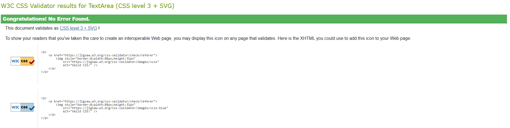
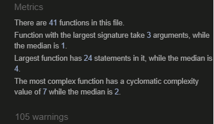
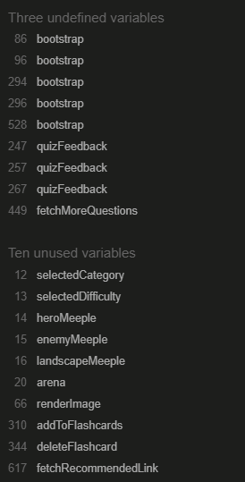
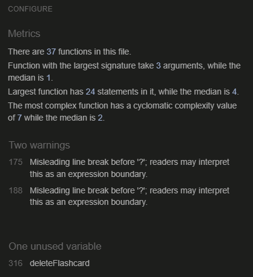

# Vikode's Saga for Knowledge

### [**Enter Saga**](https://github.com/JLatham85/vikodes-saga-for-knowledge)

<!--Write a paragraph ot 2 About the website, it's function and goals-->

Vikode’s Saga for Knowledge is a dynamic, quiz-based web application forged in the fires of HTML, CSS, and JavaScript. Designed as a battle between mind and myth, this site transforms traditional learning into an interactive duel—where each question is a strike, and each answer shapes the outcome of a fight scene above.

The goal of this project is to gamify knowledge acquisition through responsive feedback, immersive visuals, and progressive challenge. Users engage in quiz battles, earning damage for correct answers and taking hits for mistakes. Future expansions may include flashcard rituals for missed questions, difficulty glyphs, unlockable warriors, and gear upgrades—making this not just a quiz, but a journey through the realms of learning.

<!--Insert img with the different platforms and how the screen is displayed-->

## Contents

<!--Change contents to relevance this is just initial layout and add links to relevant section, use into collapse & expand lists for ease of navigation-->

 

<i>Expand Me/ Collapse Me - I'll let you decide</i>

### Table of Contents

- [User Goals](#user-goals)
- [User Stories](#user-stories)
- [Website Goals & Objectives](#website-goals-and-objective)
- [Target Audience](#target-audience)
- [Wireframes](#wire-frames)
  - Mobile Wireframes
  - Tablet Wireframes
  - Laptop Wireframes
  - Desktop Wireframes
- [Design Choices](#design-choices)
  - Typography
  - Color Scheme
  - Images
  - Responsiveness
- [Features](#features) <!--Review and complete this section when wireframes completed-->
  - Existing Features
    - Header
    - Footer
    - 404 HTML Error Page
    - 404 Under Construction
- [Future Improvements](#future-improvements)
- [Technologies Used](#technologies-used)
  - Languages
  - Libraries & Framework
  - Tools
- [Testing](#testing)
  - Bugs Fixed
  - Responsiveness Tests
  - Code Validation
    - HTML
    - CSS
  - Feature Testing
  - Accessibility Testing
  - Lighthouse Testing
  - Browser Testing
- [Deployment](#deployment)
  - To deploy the project
  - To fork the project
  - To clone the project
- [Credits](#credits)

[Back to Top of Contents](#contents)

<!--Add link to back to top of contents-->

## User Goals<!--Add what I believe the user goals are-->

The primary goal of Vikode’s Saga for Knowledge is to transform learning into an engaging, interactive experience. Users aren’t just answering questions—they’re stepping into a battle arena where knowledge becomes power and every answer shapes the outcome of a fight.

This project aims to:

- Make learning fun and immersive through gamified quiz mechanics
- Provide immediate feedback with visual cues and health-based consequences
- Encourage replayability and mastery by tracking performance and offering future   flashcard reviews
- Support different learning styles with visual storytelling, interactive elements, and progressive challenge

By blending education with narrative and interactivity, this saga invites users to learn not just with their minds—but with their mythic spirit.

[Back to Contents](#contents)

## User Stories<!--Use github project and use link-->

To ensure the Saga for Knowledge meets the needs of its adventurers, the following user stories were considered during development:

- Understanding the Realm [#1](https://github.com/JLatham85/vikodes-saga-for-knowledge/issues/2)
- Ease of Accessibility [#2](https://github.com/JLatham85/vikodes-saga-for-knowledge/issues/3)
- Consistency Throughout the Site [#3](https://github.com/JLatham85/vikodes-saga-for-knowledge/issues/4)
- Introduction Sessions [#4](https://github.com/JLatham85/vikodes-saga-for-knowledge/issues/5)
- Flashcard Rituals [#5](https://github.com/JLatham85/vikodes-saga-for-knowledge/issues/1)
- Battle Feedback [#6](https://github.com/JLatham85/vikodes-saga-for-knowledge/issues/6)
- Difficulty Glyphs [#7](https://github.com/JLatham85/vikodes-saga-for-knowledge/issues/7)
- Unlockable Warriors and Gear [#8](https://github.com/JLatham85/vikodes-saga-for-knowledge/issues/8)

[Back to Contents](#contents)

## Website Goals and Objective<!--Whats my aim for this website-->

The goal of Vikode’s Saga for Knowledge is to create a dynamic, interactive learning experience that merges quiz-based gameplay with narrative immersion. This project aims to:

- Transform traditional quizzes into engaging battle scenes
- Encourage learning through visual feedback and responsive interactivity
- Provide users with tools to track progress and revisit missed questions
- Offer scalable features like difficulty levels, unlockable characters, and gear upgrades
- Meet all MS2 requirements including custom code, structured layout, documentation, and deployment
- Make learning fun, replayable, and emotionally resonant

This site is not just a tool—it’s a journey through knowledge, where every answer is a step forward and every mistake a lesson earned.

[Back to Contents](#contents)

## Target Audience<!--Who or what audience is the website aimed at-->

This project is designed for:

- Learners who enjoy gamified experiences and visual storytelling
- Beginners seeking an accessible, engaging way to test and build knowledge
- Users who benefit from immediate feedback and interactive progression
- Adventurers who want to track their growth and revisit past challenges
- Educators or mentors looking for creative ways to present quiz content
- Anyone who believes learning should feel like a quest—not a chore

Whether you’re a seasoned warrior or a curious newcomer, Vikode’s Saga for Knowledge invites you to learn boldly, battle wisely, and grow mythically.

[Back to Contents](#contents)

## Wireframes<!--Add what tool was used explain best practices-->

 

<i>Expand Me/ Collapse Me - I'll let you decide</i>

#### **Home Page Wireframes** <!--Create link to wireframe or copy and paste wireframe-->

- [Mobile, iPad & Navbar Wireframes](docs/wireframes/home-mobile-ipad.png)
- [Laptop Wireframe](docs/wireframes/home-laptop.png)
- [Desktop Wireframe](docs/wireframes/home-desktop.png)

#### **Play Game Page Wireframes** <!--Create link to wireframe or copy and paste wireframe-->

- [Mobile, iPad Wireframes](docs/wireframes/play-game-mobile-ipad.png)

- [Laptop Wireframe](docs/wireframes/how-to-play-laptop.png)

- [Desktop Wireframe](docs/wireframes/play-game-desktop.png)

#### **GloomhavenHow to Play Page Wireframes** <!--Create link to wireframe or copy and paste wireframe-->

- [Mobile, iPad Wireframes](docs/wireframes/how-to-play-mobile-ipad.png)

- [Laptop Wireframe](docs/wireframes/quiz-laptop.png)

- [Desktop Wireframe](/docs/wireframes/how-to-play-desktop.png)

#### **Saga of Knowledge Page Wireframes** <!--Create link to wireframe or copy and paste wireframe-->

- [Mobile, iPad Wireframes](docs/wireframes/topic-level-mobile-ipad.png)

- [Laptop Wireframe](docs/wireframes/topic-level-laptop.png)

- [Desktop Wireframe](docs/wireframes/topic-level-desktop.png)

#### **Quiz Page Wireframes** <!--Create link to wireframe or copy and paste wireframe-->

- [Mobile, iPad Wireframes](docs/wireframes/quiz-mobile-ipad.png)

- [Laptop Wireframe](docs/wireframes/topic-level-laptop.png)

- [Desktop Wireframe](docs/wireframes/topic-level-desktop.png)

#### **EventsAnswer pop-up Page Wireframes** <!--Create link to wireframe or copy and paste wireframe-->

- [Mobile, iPad Wireframes](docs/wireframes/answer-quiz-mobile-ipad.png)

- [Laptop Wireframe](docs/wireframes/answer-quiz-laptop.png)

- [Desktop Wireframe](docs/wireframes/answer-quiz-desktop.png)

#### **Quiz Complete Page Wireframes** <!--Create link to wireframe or copy and paste wireframe-->

- [Mobile, iPad Wireframes](docs/wireframes/complete-mobile-ipad.png)

- [Laptop Wireframe](docs/wireframes/completed-laptop.png)

- [Desktop Wireframe](docs/wireframes/completed-desktop.png)

#### **Flash Cards Wireframes** <!--Create link to wireframe or copy and paste wireframe-->

- [Meetup Form Wireframe](docs/wireframes/flash-cards-mobile-ipad.png)

- [Introduction Form Wireframe](docs/wireframes/home-laptop.png)

- [Success Form](docs/wireframes/flash-cards-desktop.png)

#### **Battle Armament Page Wireframes** <!--Create link to wireframe or copy and paste wireframe-->

- [Mobile, iPad Wireframes](docs/wireframes/battle-armament-mobile-ipad.png)

- [Laptop Wireframe](docs/wireframes/battle-armament-laptop.png)

- [Desktop Wireframe](docs/wireframes/battle-armament-desktop.png)

- Feedback Form Part 1 & 2
  - [Feedback Form Part 1 Wireframe]
  - [Feedback Form Part 2 Wireframe]

#### **404 Error Page Wireframes** <!--Create link to wireframe or copy and paste wireframe-->

- [Mobile, iPad Wireframes](docs/wireframes/404-mobile-ipad.png)

- [Laptop Wireframe](docs/wireframes/404-laptop.png)

- [Desktop Wireframe](docs/wireframes/404-desktop.png)

[Back to Contents](#contents)

## Design Choices

 

<i>Expand Me/ Collapse Me - I'll let you decide</i>

#### **Typography**

To reflect the mythic tone and interactive nature of Vikode’s Saga for Knowledge, the following typefaces were chosen (review table below). These fonts were selected to balance narrative immersion with functional clarity, ensuring users can engage with the content while feeling part of a mythic journey. I will also have sans-serif font to back in case original choices fail.

| Font             |      Utilisation         |
| ---------------- | :----------------------: |
| Cinzel           | Main titles & Headings   |
| Open Sans        | Main body of text        |
| Accent Font      | Sparingly for UI elements|

#### **Color Scheme** <!--Use a contrast site as well and mention this-->

<!--CSS Name - Color in css thats pre-determined-->

The color scheme for Vikode’s Saga for Knowledge was chosen to evoke the intensity of battle, the elegance of myth, and the clarity of learning. [Coolers](https://coolors.co/) was the website used for color pallette.

- [Color Palette](docs/design/color-palette.png)

<!--Comment - Where is this predetermined color for-->

The below will display that I have used a contrast grid to make sure website is visually appearing but also accessible to all who will view, also I have noted the root CSS Variables I will be utilising. [Eight Shapes](https://contrast-grid.eightshapes.com/) was the website used for color pallette.

- [Contrast Grid](docs/design/contrast-grid.png)

- CSS Variables

All the below where contrasted then selected for the different categories and will be used as the CSS Variables thoughtout my code. Assisted by [Webaim](https://webaim.org/resources/contrastchecker/) to get a visual prior to selection.

| CSS Name      |   HEX   |       RGB        | Comment                                    |
| ------------- | :-----: | :--------------: | ------------------------------------------ |
| Fire Brick     | #B22222 |  rgb(178 34 34)   | Background for forms and unhovered buttons |
| White   | #FFFFFF | rgb(255 255 255) | Foreground for forms and unhovered buttons |
| White | #FFFFFF |  rgb(255 255 255)   | Background for hovered buttons             |
| Fire Brick   | #B22222 | rgb(178 34 34) | Foreground for hovered buttons             |
| Fire Brick        | #B22222 |  rgb(178 34 34)   | Background for Header and Footer           |
| Gold   | #FFD700 | rgb(255 215 0) | Foreground for Header and Footer           |
| White     | #FFFFFF | rgb(255 255 255)  | Highlight color in Header footer for links |
| Eerie Black   | #1C1C1C | rgb(28 28 28) | Main page Background                       |
| Gold        | #FFD700 |  rgb(255 215 0)   | Main font color for main pages             |

#### **Images** <!--Insert any tools used to generate images and add which programme we used to render-->

A lot of the images were taken new by myself. However wikipedia was used for the image under the section title. Co-pilot was used for the Icons on the cards.

#### **Responsiveness**

The completed website will be responsive to the Bootstrap breakpoints, which will for all screen sizes. This is to assist all viewers to have a seemless experience within the website.

| Break Point       | Class infix | Dimensions |
| ----------------- | :---------: | ---------- |
| X-Small           |    None     | <576px     |
| Small             |     sm      | >=576px    |
| Medium            |     md      | >=768px    |
| Large             |     lg      | >=992px    |
| Extra Large       |     xl      | >=1200px   |
| Extra extra Large |     xxl     | >=1400px   |

 <!--Insert before this details to include in Design choices-->

<!--Add back to top link for design choices-->

[Back to Contents](#contents)

## Features<!--Add features as we go on with coding written-->

 

<i>Expand Me/ Collapse Me - I'll let you decide</i>

#### **Existing Features** <!--Add features as we go on with coding evidenced-->

- Header

- Footer

- Scrolling page for ease of navigation on the dominate devices i.e. smartphone and tablets.

- 404 HTML Error Page

- Under maintenance page

- Forms for booking and feedback to be able to continually improve.

- Users answer questions to deal damage or receive it, turning learning into a dynamic combat experience.
- Both player and enemy have health bars that respond to correct and incorrect answers, adding visual feedback and urgency.
- Each answer triggers animations and effects that reinforce learning outcomes and keep users engaged.
- Users can retake battles to improve their score, reinforcing mastery through repetition.
- The site adapts across devices, ensuring accessibility and usability for all adventurers.
- Semantic HTML, ARIA roles, and alt-text ensure the experience is inclusive and screen-reader friendly.
- Fonts, colors, and layout choices reflect a mythic tone, immersing users in a story-rich learning environment.

<!--Add additional when wireframe designs is done-->

 <!--Insert before this details to include in Features-->

[Back to Contents](#contents)

## Future Improvements<!--Add targets once website complete-->

- Implement Unlockable Characters and Gear as rewards for progress and replayability
- Expand Question Categories to support broader learning themes and subject areas
- Add Multilingual Support to make the experience accessible to non-English speakers
- Create Progress Tracking with stats, streaks, and achievements
- Enhance Accessibility Features including keyboard navigation and contrast toggles
- Develop Admin Panel for educators to upload custom questions and monitor learner progress
- Integrate Sound Effects and Music to deepen immersion and emotional feedback
- Explore Mobile Optimization and potential app deployment for on-the-go learning

[Back to Contents](#contents)

## Technologies Used

<i>Expand Me/ Collapse Me - I'll let you decide</i>

#### **Languages**

- HTML5 — For semantic structure and accessible layout
- CSS3 — For styling, responsive design, and immersive visual presentation
- JavaScript (ES6+) — For interactivity, animations, and quiz logic
- Markdown — Used for documentation, including README and GitHub issues

#### **Libraries and Framework** <!--List below is genric add/ remove where necessary-->

- jQuery — Simplifies DOM traversal, event handling, and animations
- Font Awesome — Provides scalable vector icons for UI elements and feedback
- Google Fonts — Delivers custom typography (e.g., Cinzel, Open Sans) for immersive styling
- Bootstrap or Tailwind (optional) — For rapid layout prototyping or utility-based styling
- Favicon

Planned or optional additions:
- Chart.js — For visualizing progress, stats, or flashcard performance
- i18next — For future multilingual support and internationalization
- GSAP or Anime.js — For advanced animations and battle effects

#### **Tools** <!--List below is genric add/ remove where necessary-->

- Visual Studio Code — Primary code editor for HTML, CSS, and JavaScript development
- Git & GitHub — Version control and collaborative repository management
- GitHub Projects — For tracking user stories, tasks, and progress
- Balsamiq — For wireframe design
- Google Fonts — For importing custom typefaces
- Font Awesome — For scalable iconography
- WAVE & Lighthouse — For accessibility and performance testing
- W3C HTML Validator — Ensures semantic, standards-compliant HTML structure
- W3C CSS Validator — Verifies CSS syntax and flags potential styling issues
- Copilot — AI-powered coding companion used for iterative development, debugging, and creative problem-solving
- Markdown — For structured documentation and GitHub formatting
- Netlify / GitHub Pages — For deployment and live hosting
- Google Gemini (Images)
- JS Lint

[Back to Contents](#contents)

## Testing<!--Brief description of how, what & why was tested-->

 

<i>Expand Me/ Collapse Me - I'll let you decide</i>

#### **Bugs** <!--Any bugs found status and if fixed in a table array-->

This universe was fully tested, I have used the table below to document any bugs I came across whilst manually testing. I will summarise the results below the table.

 

<i>Expand Me/ Collapse Me - I'll let you decide</i>

| Bug Found                                                                | Resolved | How                                                                                                      |
| ------------------------------------------------------------------------ | -------- | -------------------------------------------------------------------------------------------------------- |
| renderQuiz was not identifying | Yes | Removed the duplicates which was preventing operation due to over writing |
| handleANswer was not updating hearts | Yes | Added additonal Javascript to correct |
| Incorrect classes running between HTML, CSS and JS | Yes | Went through methodically and cross-referenced |
| Images rendering incorrectly and messy | Yes | Removed  tags |
| Question quantity was stopping the end battle funnction | Yes | Searched topics that had minimum 19 question as this would got till hero or eemy loses and increased in JS |
| Bigger screens in the flaschcard section the flashcard bodies were different heights when changes to 2 columns | Yes | set the body to be consistent and fixed the delete button to the bottom |
|Landing page buttons still navigated before introModal showed| Yes| Locked navigation buttons until introModal Closed|
| Site was loosing it's identity | Yes | Changed it so all font was retro |
| Mobile version had to scroll and UX not great | Yes | Changed img sizes, landscape sizes and hearts radius |

#### **Responsivness Tests**

 

<i>Expand Me/ Collapse Me - I'll let you decide</i>

To ensure a seamless experience across all devices, I followed a mobile-first approach during development. Starting with the smallest viewport, I designed and tested the layout on an iPhone to prioritize clarity and usability for adventurers on the go. I then progressively scaled the interface, checking responsiveness on an iPad, laptop, and full desktop display. This iterative testing helped refine layout behavior, image scaling, and content flow—ensuring the Vikodes Saga for Knowledge site remains immersive and accessible across screen sizes.

| Device  | Screen Size Range | Testing Focus                      | Result |
| ------- | ----------------- | ---------------------------------- | ------ |
| iPhone  | 375px             | Mobile-first layout, image scaling | Passed |
| iPad    | 768px             | Grid wrapping, card alignment      | Passed |
| Laptop  | 1200px            | Content spacing, header behavior   | Passed |
| Desktop | 1400px            | Full-width layout, visual balance  | Passed |

<!--Couple of paragraphs on what test where ran how, where, why. Also table array for checklist-->

#### **Code Validation**

 

<i>Expand Me/ Collapse Me - I'll let you decide</i>

##### HTML:

I used [W3C Markup Validation Service](https://validator.w3.org/#validate_by_input). I have tested index.html.

- Main page with sections (Prettier kept adding trailing slashes back, so concentrated time on actual errors) 28 Errors and 1 warnings to correct. 

<!--Brief description of validators used, what was tested i.e. page amount, how many errors. Also Pic example-->

##### CSS:

I used [W3C CSS Validation Service](https://jigsaw.w3.org/css-validator/). I have tested style.css.

- CSS stylesheet checker returned no errors

<!--Brief description of validators used, what was tested i.e. page amount, how many errors. Also Pic example-->

##### JavaScript:

I used [JS Hint](https://jshint.com/). I have tested script.js.

- 105 warnings
- 3 Undefined variables
- 10 unused variables

<!--Brief description of validators used, what was tested i.e. page amount, how many errors. Also Pic example-->

#### User Story Testing:

| User Story                                                                               | Result                                                                    | Pass | Screenshot                                                |
| ---------------------------------------------------------------------------------------- | ------------------------------------------------------------------------- | ---- | --------------------------------------------------------- |
| As a new user, I want clear instructions and intuitive navigation so I can understand how to play and learn without confusion.                                         | Added How to play and simple navigation on landing page         | Yes  | [How to Pay Button](docs/testing/how-to-play-button.png "How to Pay Button") and [How to Pay Instruction](docs/testing/how-to-play-instructions.png "How to Pay Instructions")         |
| As a learner who wants to improve, I want to review questions I got wrong, so I can reinforce my understanding and track my progress.                   | User can can view incorrect answers in "Flashcards"                                            | Yes  | [Flashcards View](docs/testing/flashcards-view.png "Flashcards View")               |
| As a user with varying needs, I want the site to be accessible across devices and screen readers so I can engage with the content comfortably.                        | Mobile first approach for the build | Yes  | I have tested across all platforms   |
| As a returning user, I want consistent design and behavior across all pages so I feel immersed in a cohesive experience.           | Same consistency throughout site    | Yes  | Planned prior to building the site and maintained vigilence throughout buld |
| As a player, I want visual feedback (damage dealt or received) based on my answers so I feel engaged and motivated to improve.                | Added hearts that decrease either enemy or hero depending on the wrong or right answer and the a shake function to highlight more                                                   | Yes  | Please play the game to see               |

#### **Feature Testing** <!--How, what, why & result description - potentially create checklist in excel or table here of features and testing results-->

 

<i>Expand Me/ Collapse Me - I'll let you decide</i>

All features where manually tested on google chrome, safari. Also, manually tested o physical iPhone, iPad, Laptop and Desktop as well as devtools.

 <!--Add above here for Feature Testing-->

#### **Accessibility Testing**

 

<i>Expand Me/ Collapse Me - I'll let you decide</i>

##### **Wave Tool** <!--Use wave tool to test and how, what, where, why & result if errors-->

I wanted to make sure individuals with diverse needs could access the website comfortable so used [Wave Tool](https://wave.webaim.org/), please see below for results:

- Test 1 

- Test 2

#### **Lighthouse Testing** <!--How, what, why & result description - potentially download errors page convert to excel list How, what, where, why & result if errors-->

 

<i>Expand Me/ Collapse Me - I'll let you decide</i>

Gloomhaven Unoverse has been tested using [Lighthouse Testing](https://lighthouse-metrics.com/lighthouse) I have checked on both Google CHrome and Microsoft edge, this is testing:

- Performance
- Accessibility
- Best Practices
- SEO's

- Google Chrome Test

- Microsoft Edge Test

 <!--Add above here for Lighthouse Testing-->

[Back to Contents](#contents)

## **Deployment**<!--Describe how you deployed (if relevant also forked & cloned) through GitHub-->

 

<i>Expand Me/ Collapse Me - I'll let you decide</i>

Gloomhaven Universe was officially deployed early on in the project, as I found inconsistencies between the local and Github.

- Access my repository on GitHub and navigate to settings.

- Click on PAGES on the left pane.

- Then SAVE

- Website live address [GitHub live address](https://jlatham85.github.io/gloomhaven-universe)

- Any future changes either by my peers suggestion or my own perfectionism can be changed and pushed to GitHub.

 <!--Add above here for Deployment-->

[Back to Contents](#contents)

## **Credits**

 

<i>Expand Me/ Collapse Me - I'll let you decide</i>

- Supported from:
  - Simen Daehlin

- Coding Assistance and inspiration:
  - Co-Pilot (For understanding certain aspects)
  - Many you tube videos to be able to understand certain concepts

- Visual Content:
  - Myself
  - Wikipedia
  - Jen Charlton (Frosthaven images)

- Images:
  - Co Pilot for my logo

 <!--Add above here for Credits-->

[Back to Contents](#contents)

